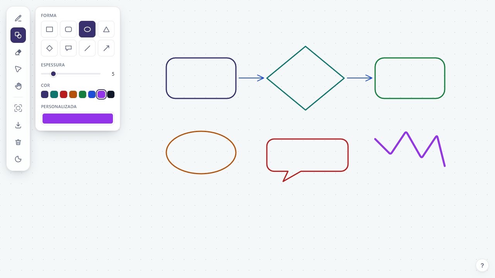
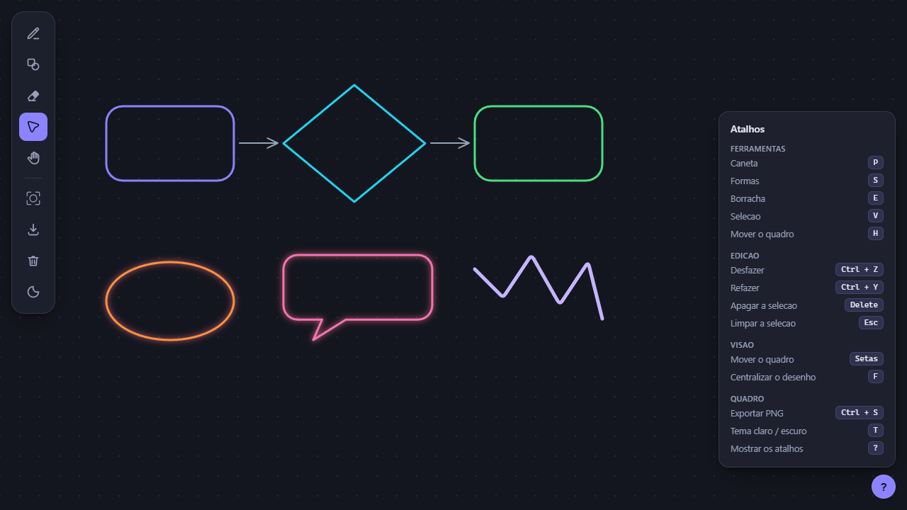

# Whiteboard

Um quadro branco infinito para desenhar no navegador: caneta a mao livre, formas
prontas, borracha, selecao e exportacao em PNG.

Sem framework. TypeScript puro, um `<canvas>` 2D e CSS, empacotados pelo
[Vite](https://vite.dev). O HTML tem so os containers vazios — a barra de
ferramentas, os paineis e o cartao de atalhos sao montados em codigo.



## Comecando

```bash
npm install
npm start
```

O `npm start` sobe o servidor de desenvolvimento e abre o navegador. Nao e
preciso abrir o `index.html` na mao.

| Comando             | O que faz                                          |
| ------------------- | -------------------------------------------------- |
| `npm start`         | Servidor de desenvolvimento (igual a `npm run dev`) |
| `npm run build`     | Checa os tipos e gera a versao final em `dist/`     |
| `npm run preview`   | Serve o conteudo de `dist/` para conferir o build   |
| `npm run typecheck` | So a checagem de tipos                              |
| `npm test`          | Testes de unidade (Vitest)                          |
| `npm run test:e2e`  | Testes de ponta a ponta (Playwright)                |

## As ferramentas

**Caneta** desenha a mao livre. Os pontos capturados passam por um suavizador de
curvas quadraticas, entao o traco nao sai serrilhado.

**Formas** cria retangulo, retangulo arredondado, elipse, triangulo, losango,
balao de fala, linha e seta. Arraste a diagonal para definir o tamanho.

**Borracha** apaga o traco inteiro que estiver debaixo do circulo — nao apaga
pedacinhos.

**Selecao** marca, move e apaga:

- clique num traco para seleciona-lo;
- arraste no vazio para abrir o retangulo de selecao;
- segure `Ctrl` (ou `Shift`) para somar a selecao, clicando ou arrastando. Um
  `Ctrl + clique` no que ja estava marcado tira ele da selecao;
- arraste a partir de qualquer traco selecionado e a selecao inteira vai junto;
- `Delete` apaga o que estiver marcado.

**Mao** arrasta o quadro. A roda do mouse e as setas do teclado fazem o mesmo.

### A tecla Shift

Segurando `Shift` durante o arrasto de uma forma:

- caixas e elipses ficam com os lados iguais (quadrado, circulo);
- linhas e setas travam no angulo de 45 graus mais proximo, o que inclui a
  horizontal e a vertical exatas.

## Atalhos

| Tecla      | Acao                     |
| ---------- | ------------------------ |
| `P`        | Caneta                   |
| `S`        | Formas                   |
| `E`        | Borracha                 |
| `V`        | Selecao                  |
| `H`        | Mover o quadro           |
| `Ctrl + Z` | Desfazer                 |
| `Ctrl + Y` | Refazer                  |
| `Delete`   | Apagar a selecao         |
| `Esc`      | Limpar a selecao         |
| Setas      | Mover o quadro           |
| `F`        | Centralizar o desenho    |
| `Ctrl + S` | Exportar PNG             |
| `T`        | Tema claro / escuro      |
| `?`        | Mostrar todos os atalhos |

O tema acompanha o sistema ate voce escolher um, e a escolha fica salva no
`localStorage`.



## Como o codigo esta organizado

```
index.html              a pagina, so com os containers vazios
src/
  main.ts               liga as pecas e inicia o app
  core/
    types.ts            IDrawing, ISelectionArea, ETools, IPointerInfo
    Variable.ts         valor observavel que se liga a elementos da pagina
    SharedVariables.ts  estado compartilhado (ferramenta, forma, cor, espessura)
    geometry.ts         distancias, colisao com o traco, area de selecao
    shapes.ts           contorno das formas prontas
    History.ts          pilha de desfazer por instantaneos
  board/
    WhiteBoard.ts       estado do quadro e roteamento dos eventos do ponteiro
    Renderer.ts         tudo que toca no contexto 2D
    Viewport.ts         deslocamento da visao e conversao de coordenadas
  tools/
    Tool.ts             classe base das ferramentas
    Pen.ts ShapeTool.ts Eraser.ts Cursor.ts Hand.ts
  ui/
    ToolBar.ts          barra flutuante
    ToolBarButton.ts    botao da barra
    PopUp.ts            base dos paineis de ajuste
    PenPopUp.ts ShapePopUp.ts EraserPopUp.ts
    InkControls.ts      espessura e cor, compartilhados por caneta e formas
    HintsPanel.ts       cartao de atalhos
    shortcuts.ts        teclado
    theme.ts            claro / escuro
    icons.ts shapeIcons.ts dom.ts
  styles/
    tokens.css          paleta e medidas
    main.css            layout e componentes
  assets/icons/         os SVG da barra, em currentColor
tests/
  unit/                 geometria, formas, historico e Variable (Vitest)
  e2e/                  o quadro inteiro pelo navegador (Playwright)
```

### As quatro ideias que sustentam o resto

**Tudo no quadro e uma lista de pontos.** Um rabisco a mao e um balao de fala
sao o mesmo `IDrawing`; muda so como os pontos foram gerados e como sao ligados
(`smooth`, `closed`). Por isso apagar, selecionar, mover, desfazer e exportar
funcionam em qualquer coisa desenhada, sem nenhum caso especial. Criar uma forma
nova e escrever uma funcao que devolve pontos em `core/shapes.ts`.

**`Variable<T>` e o observavel da casa.** Um valor que aparece na tela e que
outras partes precisam acompanhar vira um `Variable`: `associateElement` liga o
valor a um `<input>` (nos dois sentidos) ou a um texto, e `addListener` avisa
quem precisa reagir. A ferramenta ativa, a forma escolhida, a cor e a espessura
sao todas assim — e por isso a barra nao precisa conhecer o quadro.

**O quadro e dono do estado.** As ferramentas nao mexem na lista de tracos: elas
chamam `setCurrentStroke`, `eraseAt`, `moveSelected`, `selectWithinArea`. Cada
gesto do ponteiro abre e fecha um "gesto" no `History`, e e assim que um
arrastao inteiro da borracha, ou de uma selecao, volta com um unico `Ctrl + Z`.

**As cores do canvas vem do CSS.** O `Renderer` le as variaveis de
`styles/tokens.css` em tempo de execucao, entao o tema claro/escuro vale para o
desenho sem paleta duplicada no TypeScript.

### Detalhes que talvez surpreendam

- A caneta e a borracha escondem o cursor do sistema (`cursor: none`) e o proprio
  canvas desenha um circulo do tamanho exato do traco. Assim nada fica na frente
  do ponto onde se vai desenhar.
- O canvas respeita o `devicePixelRatio`, entao o traco continua nitido em telas
  com escala acima de 100%.
- A entrada e por eventos de ponteiro, nao de mouse, entao dedo e caneta
  funcionam do mesmo jeito.
- O PNG exportado sai sem a grade, sem o brilho de selecao e com o fundo
  preenchido — so o desenho.

## Testes

```bash
npm test           # unidade
npm run test:e2e   # navegador
```

Os testes de unidade cobrem o que e logica pura: geometria, geracao das formas,
a pilha de desfazer e o `Variable`.

Os de ponta a ponta sobem o servidor sozinhos e dirigem o quadro por mouse e
teclado de verdade. Eles leem o estado por `window.whiteboard`, que `src/main.ts`
publica **apenas** em modo de desenvolvimento, dentro de um
`if (import.meta.env.DEV)` — no pacote de producao o bloco inteiro desaparece.
